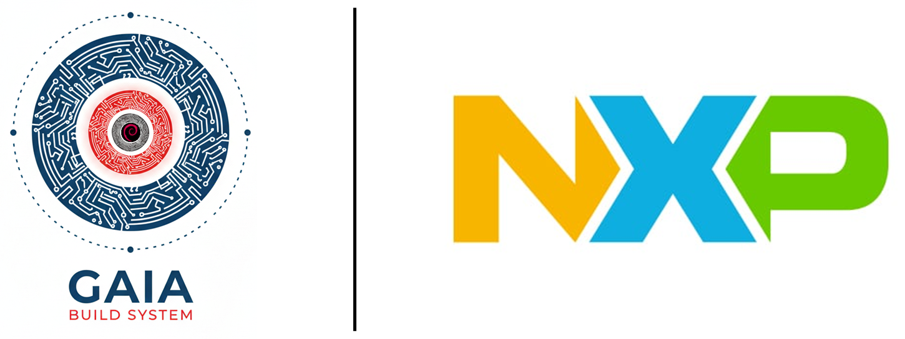

# Cookbook for NXP iMX Platform Machines

<p align="center">
    
</p>

This cookbook provides a collection of recipes to help you get started with DeimOS for NXP iMX Platform based boards.

## Supported Boards -> Machine

> ⚠️ As this grows we could change the machine name to a more generic name.

| Board                       | Gaia Machine Name   |
|-----------------------------|---------------------|
| Toradex SMARC iMX95         | smarc-imx95         |
| Toradex iMX95 EVK           | imx95-verdin-evk    |
| NXP iMX93 Freedom Board     | imx93-frdm          |
| Toradex Verdin iMX8M Plus   | imx8mp-verdin       |

## Prerequisites

- [Gaia project Gaia Core](https://github.com/gaiaBuildSystem/gaia);

## Build an Image

```bash
./gaia/scripts/bitcook/gaia.ts --buildPath /home/user/workdir --distro ./cookbook-nxp/distro-ref-imx95-verdin-evk.json
```

This will build DeimOS for Toradex iMX95 Verdin EVK.
